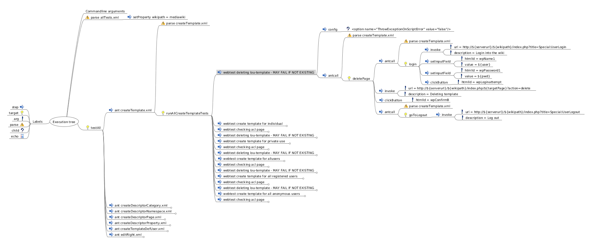

# Ant Inspector

Tool I developed to inspect [Apache Ant](https://ant.apache.org) build.xml scripts visually.

Say you have a project with a complex set of ant build scripts and you need to get an overview of what some specific target does. For example, to visualize the tasks that would be executed when running:

```Shell
ant -f release.xml -Drelease.version=1.0 make-release
```

.. you would execute:

```Shell
./ant2fm -f release.xml -D release.version=1.0 make-release > make-release.fm
freemind make-release.fm
```

This produces a file `make-release.fm` and opens it for browsing in the venerable [Freemind mindmapping tool](http://freemind.sourceforge.net/wiki/index.php/Main_Page). Other tools supporting the same file format can be used, of course.

Please note that the actual tasks are not run; it's merely a simulation. Any conditional parts will include both the "if true" and "if false" paths along with the condition used. This allows one to consider different outcomes in different situations, see which variables are used to decide what is done, etc.

# Example

For this randomly selected Ant build file on github:

  https://github.com/jheizmann/HaloACL/blob/3de9ac606c9ccab1acfeb3f75c2b9ae070412a8c/tests1/webtests/tests/allTests.xml

using the command `../ant2fm -b allTests.xml > foo.mm` we get the following partially expanded Freemind graph (cropped screenshot):

  <a href="https://raw.githubusercontent.com/NitorCreations/ant-inspector/master/images/example1.png"></a>

# Installation

You need:

* Freemind (or similar)
* xmllint
* Perl modules:
    * XML::Easy::Text
    * Config::Properties;

## Ubuntu (13.10)

```Shell
apt-get install freemind libxml2-utils libxml-easy-perl
cpan App::cpanminus
cpanm Config::Properties;
```

## RedHat/Fedora

```Shell
yum install freemind libxml2 perl-Config-Properties
cpan App::cpanminus
cpanm XML::Easy::Text
```

# TODO

A subset of notable shortcomings:

* Poor error reporting
* Unsupported tasks:
    * &lt;include&gt;
    * &lt;local&gt;
* Unsupported task features
    * &lt;ant inheritAll="true"&gt; (default behaviour)
    * &lt;ant dir="..."&gt;
    * &lt;ant useNativeBasedir="..."&gt;
    * &lt;ant&gt;&lt;property&gt;
    * &lt;antcall inheritAll="true"&gt; (default behaviour)
    * &lt;antcall&gt;&lt;param&gt;
